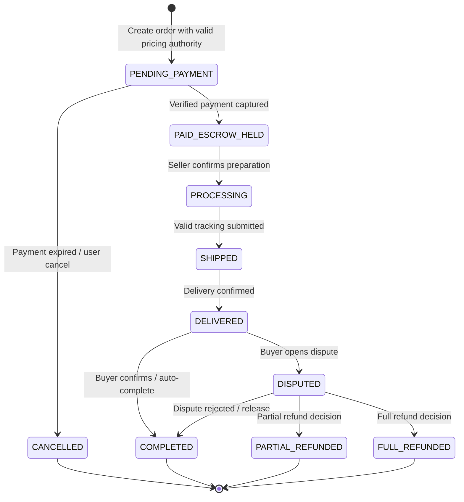
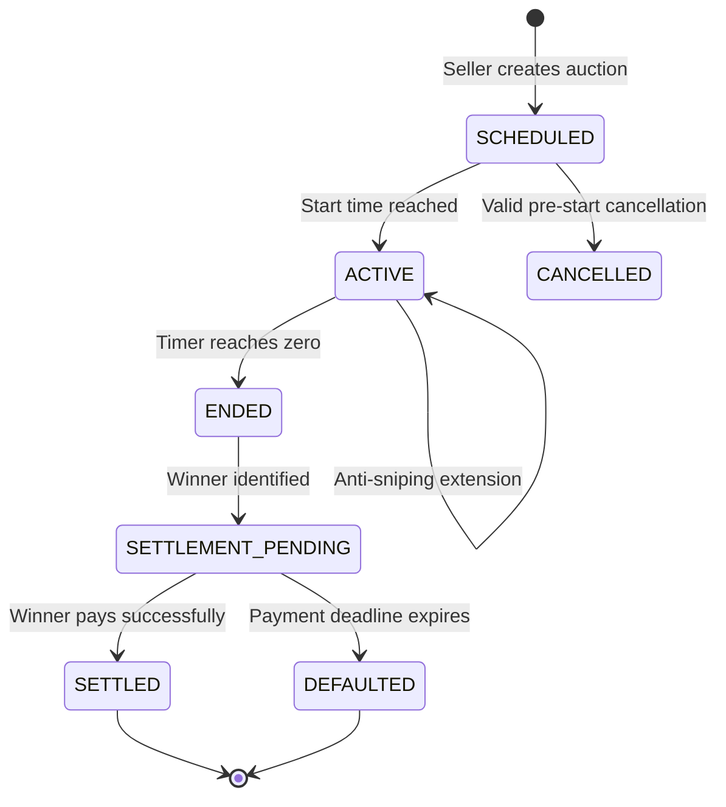
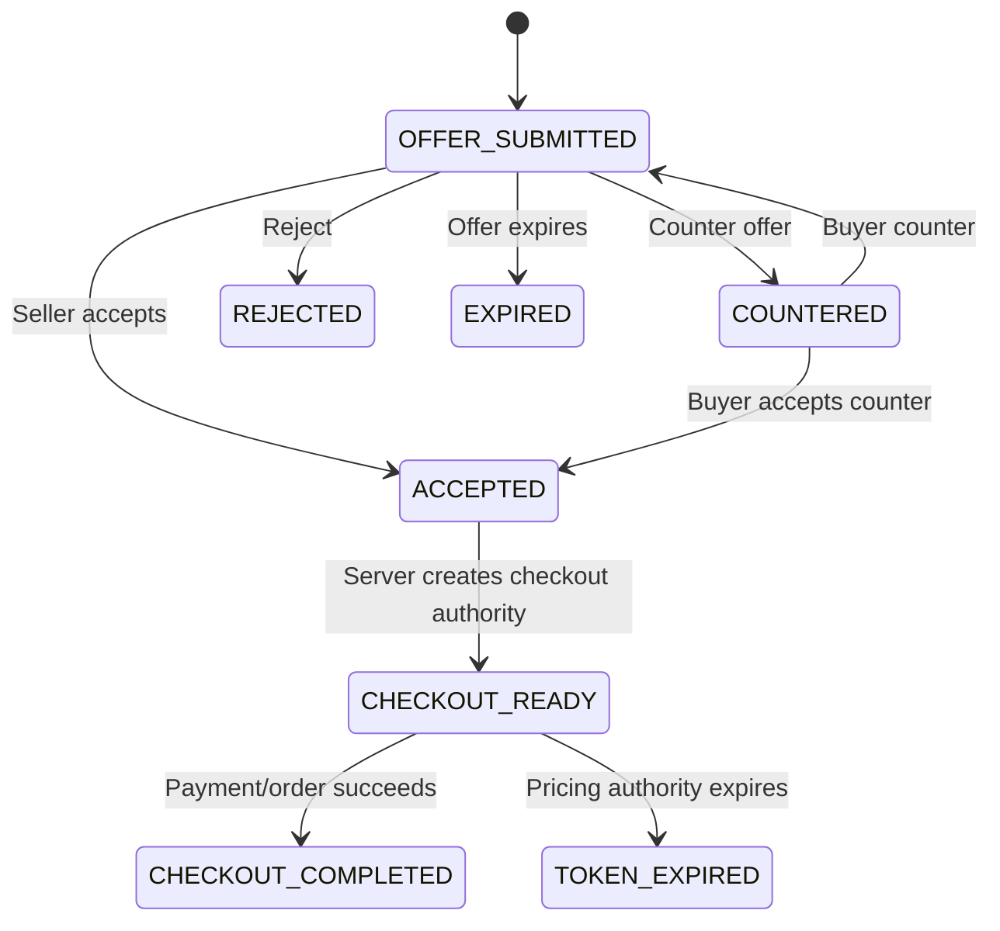
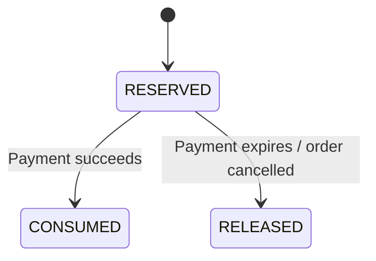

# Labuda Platform — Product, Business & Technology Blueprint

**Nama Produk:** Labuda

**Deskripsi:** Vertical Social Commerce Platform untuk ekosistem ikan koi, menggabungkan social discovery, content, direct commerce, real-time auction, in-chat negotiation, protected transaction flow, trust & KYC, serta financial ledger.

**Versi Dokumen:** 3.0.0

**Status:** Canonical Product & Technology Blueprint — Living Document

**Audience:** Founder / Owner, Product & Engineering, Operations, Strategic Partners, dan Investor

> **Document Principle:** Bagian utama menjelaskan product, business, trust, technology, dan roadmap dengan bahasa yang dapat dipahami investor. Technical Appendix mempertahankan kontrak engineering yang diperlukan untuk implementasi dan audit. Source of truth implementasi tetap repository dan database schema aktual; PRD tidak boleh menjadi alasan untuk mempertahankan desain legacy yang sudah dipurge.

---

## 1. Executive Summary

### 1.1 What is Labuda?

**Labuda** adalah platform vertical social commerce yang dirancang khusus untuk ekosistem ikan koi: breeder, dealer, seller, hobbyist, collector, dan komunitas pendukungnya.

Labuda menggabungkan pengalaman yang biasanya tersebar di banyak platform menjadi satu ekosistem:

- **Content & Social Discovery** untuk melihat, mempresentasikan, dan menemukan ikan serta pengetahuan komunitas.
- **Direct Commerce** untuk jual beli dengan harga tetap.
- **Real-Time Auction** untuk lelang dengan bidding real-time.
- **In-Chat Negotiation** untuk tawar-menawar langsung antara buyer dan seller.
- **Protected Transaction Flow** untuk mengurangi risiko transaksi informal.
- **Seller Trust & KYC** untuk memisahkan kewenangan menjual dari kewenangan menarik dana.
- **Financial Ledger** untuk menjaga integritas pencatatan finansial.
- **DOA / Dispute Workflow** untuk transaksi ikan hidup.

Flutter mobile menjadi **primary product experience**. Pada fase berikutnya, Labuda menambahkan **Next.js public web experience** sebagai discovery, SEO, sharing, dan acquisition surface, bukan sebagai pengganti aplikasi mobile atau feature-parity web application.

### 1.2 Vision

Membangun infrastruktur digital vertikal tempat komunitas koi dapat **menemukan, berinteraksi, berdagang, melakukan lelang, bernegosiasi, dan menyelesaikan transaksi dengan tingkat kepercayaan yang jauh lebih tinggi daripada transaksi berbasis media sosial dan chat umum**.

### 1.3 Product Thesis

Labuda dibangun di atas prinsip bahwa pada vertical commerce bernilai tinggi, **liquidity tanpa trust tidak cukup, dan trust tanpa community discovery juga tidak cukup**.

Karena itu Labuda menyatukan:

`Community → Discovery → Trust → Commerce → Transaction → Reputation`

Semakin banyak transaksi yang berhasil, semakin kaya graph komunitas, reputasi seller, histori transaksi, dan trust signals. Hal tersebut mendukung network effect yang menjadi salah satu calon moat jangka panjang Labuda.

---

## 2. Problem & Opportunity

### 2.1 Masalah Pasar

#### A. Fragmented Discovery

Buyer menemukan ikan melalui social media, grup chat, forum, atau jaringan pribadi; katalog, percakapan, dan transaksi tidak berada dalam satu sistem.

#### B. Trust Gap

Transaksi bernilai tinggi sering dilakukan melalui transfer manual atau perantara informal. Buyer menghadapi risiko penipuan, seller menghadapi buyer yang tidak menyelesaikan pembayaran, dan kedua pihak mempunyai sedikit mekanisme perlindungan yang terstruktur.

#### C. Dynamic Commerce Tidak Tersupport dengan Baik

Koi memiliki karakteristik yang cocok untuk auction dan negotiation. Platform umum biasanya memisahkan social content, chat, auction, dan payment sehingga buyer harus berpindah konteks.

#### D. Live-Fish Logistics Risk

Ikan hidup mempunyai risiko transportasi, packaging, oksigen, keterlambatan, dan Dead On Arrival (DOA). Mekanisme dispute yang konsisten membutuhkan bukti dan state transaksi yang terstruktur.

#### E. Client-Side Price Manipulation Risk

Harga, diskon, shipping, coins, dan payment fees tidak boleh ditentukan oleh aplikasi client. Transaksi harus menggunakan pricing yang authoritative di server.

### 2.2 Opportunity

Labuda menargetkan vertical marketplace/community dengan karakteristik:

- produk bernilai relatif tinggi;
- community-driven discovery;
- trust sangat berpengaruh terhadap conversion;
- recurring seller activity;
- auction dan negotiation mempunyai nilai nyata;
- reputasi seller dapat menjadi asset digital;
- content dapat berfungsi sekaligus sebagai acquisition surface dan commerce surface.

---

## 3. Target Market & Personas

### 3.1 Primary Personas

| Persona               | Kebutuhan Utama                                                       | Nilai Labuda                                                  |
| --------------------- | --------------------------------------------------------------------- | ------------------------------------------------------------- |
| **Hobbyist**          | Menemukan koi, mengikuti komunitas, membeli dengan aman               | Discovery, trust, commerce, auction                           |
| **Collector**         | Mencari ikan bernilai tinggi dan provenance yang jelas                | Structured content, seller reputation, transaction protection |
| **Breeder / Farm**    | Menampilkan koleksi dan menjual ikan secara terstruktur               | Store identity, listing, auction, content                     |
| **Dealer / Seller**   | Menjual berulang, membangun reputasi, menerima pembayaran terstruktur | Commerce tools, chat negotiation, seller operations           |
| **Community Creator** | Edukasi, showcase, membangun audience                                 | Content, social graph, share                                  |
| **Admin / Operator**  | Menjaga trust, dispute, finance, dan platform integrity               | Operations console, KYC, moderation, ledger audit             |

### 3.2 Secondary Ecosystem Participants

Dalam tahap lanjutan, ecosystem dapat diperluas ke logistics partners, koi service providers, equipment sellers, event/community operators, dan commercial brands yang relevan.

---

## 4. Product Ecosystem

```text
                         LABUDA ECOSYSTEM
                                │
        ┌───────────────────────┼───────────────────────┐
        │                       │                       │
        ▼                       ▼                       ▼
  Flutter Mobile          Next.js Web           Admin Console
  Primary Product          Future Public         Operations
                          Acquisition Surface
        │                       │                       │
        └───────────────────────┼───────────────────────┘
                                ▼
                         Go Application Backend
                                │
              ┌─────────────────┼─────────────────┐
              ▼                 ▼                 ▼
         PostgreSQL           Redis         Object / Media Storage
              │                 │                 │
              └─────────────────┼─────────────────┘
                                ▼
                         External Services
                 ┌──────────────┼───────────────┐
                 ▼              ▼               ▼
            Midtrans         Firebase       Logistics / Other
          Payment Gateway    Auth/Push        Integrations
```

### 4.1 Product Surfaces

#### Mobile App — Primary Product

Flutter application untuk iOS dan Android dengan feature set utama Labuda:

- identity dan account;
- feed dan content;
- social graph;
- search/discovery;
- listing;
- auction;
- chat;
- negotiation;
- checkout/payment;
- order;
- coins;
- seller operations;
- dispute;
- notification.

#### Web — Future Public Acquisition Surface

Next.js digunakan pada fase future terutama untuk:

- public profile;
- public content;
- public product/listing;
- public auction pages;
- canonical share URLs;
- SEO dan search discovery;
- social preview metadata;
- guest exploration;
- CTA untuk mengarahkan user ke aplikasi mobile.

**Web tidak diwajibkan memiliki feature parity dengan Flutter.** Transaksi dan fitur komunitas yang membutuhkan pengalaman penuh tetap berorientasi pada mobile app, dengan backend yang sama sebagai domain authority.

#### Admin Console

React + TypeScript + Vite untuk operasi internal:

- KYC;
- moderation;
- dispute;
- finance;
- seller operations;
- configuration;
- audit trail.

---

## 5. User Trust & Access Model

### 5.1 Four Trust Layers

```text
Layer A — Authentication
        ↓
Layer B — Identity Completion
        ↓
Layer C — Email Verification
        ↓
Layer D — Seller / Financial Authority
       ├── Selling Authority
       └── Payout Authority
```

### 5.2 Layer A — Authentication

User memiliki authenticated session melalui authentication infrastructure Labuda. Authentication adalah gerbang identitas, bukan business permission.

### 5.3 Layer B — Identity Completion

User menyelesaikan profile dasar dan memperoleh **unique username** sebagai identitas aplikasi yang canonical.

### 5.4 Layer C — Email Verification

User yang telah terverifikasi email memperoleh akses ke interaction dan transaction capabilities yang mensyaratkan email verification.

### 5.5 Layer D — Seller & Financial Trust

Labuda secara sengaja memisahkan:

**Selling Authority ≠ Payout Authority**

Seller dapat memperoleh selling authority sesuai persyaratan platform, termasuk seller subscription, sementara payout authority membutuhkan KYC yang disetujui.

### 5.6 Canonical User Role

Application role tidak menggunakan role `seller`. Role aplikasi canonical adalah:

- `user`
- `admin`

Kemampuan menjual berasal dari **seller profile / seller authority**, bukan dari role `seller`.

### 5.7 Trust Invariants

1. Kegagalan atau pembekuan payout tidak menghapus economic ownership seller terhadap saldo ledger.
2. Payout authority hanya tersedia setelah persyaratan KYC dipenuhi dan disetujui.
3. Client bukan authority untuk authorization, price, coin cap, order state, atau ledger.
4. Semua privileged admin action harus tercatat dalam audit trail.

---

## 6. Core Product Modules

### 6.1 Content & Social Discovery

Labuda menggunakan domain **Content**, bukan pemisahan legacy antara post/request.

Core capabilities:

- foto dan video ikan;
- metadata koi terstruktur;
- visibility lifecycle;
- feed;
- comments;
- follow/unfollow;
- block/mute;
- bookmark/save;
- unified sharing;
- public deep link;
- discovery/search.

**`contents.visibility` merupakan source of truth untuk visibility content.**

Comments merupakan bagian utama dari content interaction dan bukan optional feature toggle per content.

### 6.2 Structured Koi Content

Content dapat membawa informasi seperti:

- varietas;
- ukuran;
- jenis kelamin;
- umur;
- breeder/farm;
- certificate information;
- media.

Structured metadata membantu search, discovery, trust, dan future analytics.

### 6.3 Unified Share

Labuda memiliki satu konsep unified share yang memungkinkan content baru mereferensikan objek sumber secara typed dan immutable.

Objek yang dapat dibagikan meliputi:

- profile;
- content;
- fixed-price listing;
- auction.

Internal sharing menargetkan:

- Feed;
- Chat.

External sharing menggunakan native OS share mechanism dengan canonical public URL / deep link yang menghormati visibility dan lifecycle resource.

### 6.4 Commerce

Dua commerce primitive utama:

**Fixed Price Sale** dan **Auction**.

Seller tidak memperoleh hak otomatis untuk memasukkan produk seller lain secara langsung ke composer. Direct commerce insertion hanya diperbolehkan untuk listing/auction milik seller yang sama; produk milik seller lain diarahkan melalui unified share.

Product = barang/produk dan satu-satunya canonical identity/content.
For Sale = nama business/UI untuk penjualan harga tetap.
FixedPriceSale = nama technical/domain canonical.
Auction = selling surface lelang.

### 6.5 Fixed Price Sale

Seller dapat membuat listing harga tetap dengan stock dan informasi packaging/shipping yang relevan.

Lifecycle utama:

`DRAFT → ACTIVE → RESERVED → SOLD / INACTIVE`

### 6.6 Live Auction

Auction engine mendukung:

- scheduled auction;
- opening bid;
- minimum increment;
- optional buy-now bila diaktifkan oleh desain auction;
- live leaderboard;
- real-time bid delivery;
- anti-sniping;
- winner settlement;
- bid-and-run handling.

Server adalah authority atas highest bid dan auction state.

### 6.7 In-Chat Negotiation

Buyer dan seller dapat melakukan negotiation di dalam 1:1 chat.

Flow utama:

`Offer → Counter Offer → Accept / Reject / Expire → Checkout`

Harga hasil agreement tidak diteruskan sebagai harga mentah dari client. Backend menerbitkan pricing authority untuk checkout.

### 6.8 Search & Discovery

Discovery mendukung filter yang relevan terhadap vertical koi:

- varietas;
- ukuran;
- lokasi;
- harga;
- seller reputation;
- status listing/auction;
- content/public visibility.

Search architecture harus mendukung evolusi menuju public web discovery pada fase Next.js.

---

## 7. Commerce, Pricing & Payment Architecture

### 7.1 Server-Authoritative Pricing

Client hanya mengirimkan intent, misalnya:

- item/reference;
- shipping address;
- shipping method;
- optional coins usage.

Backend menghitung canonical transaction amount dan menerbitkan **Pricing Token** sebagai server-side pricing snapshot.

### 7.2 Pricing Token Invariants

Pricing Token mengikat data transaksi yang diperlukan untuk mencegah price manipulation, termasuk:

- product price / subtotal;
- seller-funded discount;
- shipping amount;
- applicable charges;
- coin allowance;
- transaction snapshot;
- expiration metadata.

Pricing Token memiliki TTL terbatas dan hanya dapat digunakan melalui valid transaction flow.

### 7.3 Canonical Coin Rule

**1 Labuda Coin = Rp1.**

Maksimum coin redemption adalah **20% dari harga produk setelah seller-funded discount**.

Coin cap:

- tidak dihitung dari shipping;
- tidak dihitung dari platform commission;
- tidak dihitung dari payment gateway fee.

Jumlah coin yang benar-benar digunakan harus melewati backend validation dan payment-owned reservation lifecycle.

### 7.4 Canonical Transaction Math

Gunakan:

`PD = Product Price − Seller-Funded Discount`

`S = Shipping`

`K = Coin Redemption (Rupiah)`

Buyer cash before gateway fee:

`B = PD + S − K`

Payment gateway fee dihitung sesuai payment method/provider policy atas basis transaksi yang ditetapkan payment architecture.

### 7.5 Seller-Funded Discount

Seller-funded discount:

- mengurangi amount paid by buyer;
- mengurangi seller proceeds;
- mengurangi commission basis sesuai platform pricing policy.

Discount bukan dana subsidi platform kecuali suatu program promosi secara eksplisit menyatakan sebaliknya.

### 7.6 Payment Fee Policy

Canonical policy:

- **Payment gateway fee** dibebankan kepada buyer.
- **Platform transaction fee / commission** menjadi biaya seller.
- **Seller withdrawal fee** bersifat configurable oleh admin dan dapat ditetapkan Rp0.
- Payment gateway rate mengikuti payment method dan tarif provider, dengan Midtrans sebagai payment gateway utama pada architecture saat ini.

### 7.7 Payment Architecture

```text
Client
  ↓
Labuda Pricing Engine
  ↓
Pricing Token
  ↓
Order / Payment Service
  ↓
Midtrans
  ↓
Verified Payment Webhook
  ↓
Payment State Update
  ↓
Ledger / Order Effects
```

Webhook payment harus diverifikasi dan diproses secara idempotent.

### 7.8 Active Payment Reuse

Untuk lifetime payment yang sama, payment creation tidak boleh menghasilkan payment gateway request kedua hanya karena client mengulang request. Existing active payment harus direuse sesuai canonical payment lifecycle.

### 7.9 Payment Method Authority

Canonical payment method authority adalah data pada **payment domain**, bukan stale writer pada `orders.payment_method`.

---

## 8. Order, Settlement & Financial Protection

### 8.1 Order Lifecycle

```text
PENDING_PAYMENT
      ↓
PAID / PAYMENT CAPTURED
      ↓
PROCESSING
      ↓
SHIPPED
      ↓
DELIVERED
      ├──────────────→ DISPUTED
      │                   ├→ COMPLETED / RELEASED
      │                   ├→ PARTIAL REFUND
      │                   └→ FULL REFUND
      ↓
COMPLETED
```

Exact state names remain implementation-controlled; state transitions must preserve the business invariants described here.

### 8.2 Stock Reservation

Order creation dapat melakukan stock reservation untuk mencegah overselling. Reservation harus memiliki lifecycle dan cleanup yang deterministic.

### 8.3 Protected Transaction

Labuda menggunakan controlled holding / settlement architecture untuk menjaga agar seller proceeds tidak dianggap freely withdrawable sebelum order mencapai state yang mengizinkan release.

> **Regulatory note:** wording dan struktur legal payment holding/escrow harus selalu diselaraskan dengan entitas hukum Labuda dan payment partner yang digunakan. PRD tidak mengasumsikan Labuda otomatis menjadi licensed escrow institution.

### 8.4 Seller Proceeds

Seller proceeds dicatat melalui financial ledger. Ketersediaan untuk payout berbeda dari sekadar economic ownership.

### 8.5 Refund Authority

Refund tidak dihitung ulang secara ad-hoc oleh client. Backend menggunakan canonical refund calculation berdasarkan komponen cash refund dan coin effect.

Conceptually:

`Cash Refund = Rpd + Rs − Coin Delta`

Detail posting ledger dan gateway refund berada pada payment/refund technical contract.

---

## 9. Coin Reservation & Loyalty

### 9.1 Reservation Authority

`coin_reservations` merupakan authority untuk reservation state.

Reservation adalah **payment-owned** dan memiliki satu lifetime reservation per payment.

### 9.2 State Machine

```mermaid
stateDiagram-v2
    [*] --> RESERVED: Payment creates coin reservation
    RESERVED --> CONSUMED: Payment succeeds / coin committed
    RESERVED --> RELEASED: Payment expires / order cancelled
    CONSUMED --> RELEASED: No direct reversal; refund creates canonical recredit effect
```



### 9.3 Reservation Invariants

- Reserve tidak mengurangi `user_coin_balance.balance` secara langsung.
- Release tidak menambahkan balance secara langsung.
- Consumption/recredit mengikuti ledger/domain flow.
- Orphaned reservations harus dapat dibersihkan tanpa menciptakan coin.

---

## 10. Live Fish Logistics

### 10.1 Shipping Data

Listing/order dapat membutuhkan:

- package dimensions;
- estimated weight;
- transport type;
- service name;
- sender address;
- destination;
- tracking/resi.

**Transport type dan service name merupakan data shipping yang wajib pada flow yang membutuhkannya.**

### 10.2 Logistics Integration

Platform dirancang agar logistics provider dapat diintegrasikan melalui adapter/service boundary, bukan dengan menanamkan ketergantungan provider langsung di business domain.

Contoh kategori provider:

- air cargo;
- specialist live-fish logistics;
- city courier;
- intercity transport.

Provider dan route availability harus mengikuti operasional dan regulasi aktual.

### 10.3 DOA

Karena koi adalah live animal, platform menyediakan dispute workflow yang mempertimbangkan:

- delivery confirmation;
- unboxing evidence;
- packaging condition;
- oxygen bag condition;
- fish condition;
- seller-side pre-shipping evidence;
- timestamp dan chain of evidence.

---

## 11. Dispute & Trust Operations

### 11.1 Dispute Window

Buyer dapat membuka dispute sebelum order mencapai terminal completion state dan selama claim window yang ditentukan oleh policy.

### 11.2 Evidence

Untuk DOA atau kondisi yang diperselisihkan, buyer dapat diwajibkan memberikan uncut unboxing evidence yang memperlihatkan:

- paket/resi;
- kondisi box;
- packaging;
- oxygen bag;
- kondisi ikan.

### 11.3 Admin Resolution

Admin dapat mengambil keputusan sesuai evidence dan policy:

- release to seller;
- partial refund;
- full refund;
- tindakan trust terhadap account/listing jika diperlukan.

### 11.4 Auditability

Setiap keputusan financial/dispute yang material harus memiliki:

- actor;
- target;
- action;
- reason;
- timestamp;
- audit reference.

---

## 12. Financial Architecture

### 12.1 Double-Entry Ledger

Financial truth berada pada double-entry ledger.

Invariant utama:

`Σ Debit = Σ Credit`

Saldo yang ditampilkan user merupakan projection/read model dari financial movements, bukan angka yang dapat diubah bebas oleh client.

### 12.2 Core Account Categories

| Code   | Account                    | Type      | Purpose                                                   |
| ------ | -------------------------- | --------- | --------------------------------------------------------- |
| `1001` | `GATEWAY_RECEIVABLE`       | Asset     | Receivable/settlement from payment provider               |
| `1002` | `BANK_SETTLEMENT_CASH`     | Asset     | Cash held/settled through designated bank structure       |
| `2001` | `ESCROW_HOLDING_LIABILITY` | Liability | Buyer-related transaction obligation while funds are held |
| `2002` | `SELLER_AVAILABLE_PAYABLE` | Liability | Seller proceeds available for payout                      |
| `2003` | `COIN_LOYALTY_LIABILITY`   | Liability | Outstanding coin liability                                |
| `4001` | `PLATFORM_FEE_REVENUE`     | Revenue   | Platform transaction revenue                              |
| `5001` | `PAYMENT_GATEWAY_EXPENSE`  | Expense   | Payment provider fee when contractually borne by platform |

The exact production chart of accounts remains the authoritative accounting configuration.

### 12.3 Reconciliation

Financial reconciliation target:

**zero unexplained ledger drift.**

Payment provider settlement, bank reconciliation, payout, refund, and ledger state harus dapat direkonsiliasi secara deterministik.

---

## 13. Seller Business Model

### 13.1 Seller Subscription

Seller subscription adalah business capability gate, bukan user role.

Subscription period dan pricing dikelola sebagai product configuration. **Seller registration / renewal price harus admin-configurable**, bukan hard-coded sebagai nilai tetap di application code.

### 13.2 Seller Tier / Reputation

Seller tier dapat menggunakan completion volume dan rating sebagai trust/reputation signal. Current product rule:

- **Pro:** minimal 100 completed orders dan rating ≥ 4.6.
- **Elite:** minimal 300 completed orders dan rating ≥ 4.7.

Tier adalah capability/reputation layer dan bukan pengganti KYC.

### 13.3 Revenue Model

Current core monetization:

1. **Platform transaction fee / commission** dari marketplace transactions.
2. **Seller subscription**.

Potential future monetization, subject to product validation:

- promoted discovery;
- seller analytics/tools;
- premium seller services;
- sponsorship/brand placement;
- ecosystem services.

Future monetization tidak dianggap committed revenue sebelum diluncurkan.

---

## 14. Trust, Safety, Moderation & Fraud Prevention

Trust merupakan product pillar, bukan sekadar operational support.

### 14.1 Trust Layers

- verified identity;
- verified email;
- seller authority;
- KYC/payout authority;
- transaction history;
- rating/reputation;
- dispute outcomes;
- audit trail.

### 14.2 Abuse Controls

Architecture harus mendukung:

- rate limiting;
- abuse detection;
- bid abuse detection;
- duplicate/idempotent request protection;
- account suspension;
- content moderation;
- seller trust revocation;
- payout lock;
- suspicious transaction review.

### 14.3 Privacy

KYC document dan personal data harus dipisahkan dari public content boundary. Guest access tidak boleh mengekspos private identity information yang tidak diperlukan untuk discovery.

---

## 15. Technology Stack

### 15.1 Mobile — Flutter / Dart

**Primary application platform:** Flutter.

Digunakan untuk iOS dan Android dengan satu core product codebase.

Architecture requirements mencakup:

- typed domain/data contracts;
- repository/service boundary;
- predictable state management;
- deep linking;
- push notifications;
- media capture/upload;
- resilient WebSocket reconnect;
- offline-safe local state untuk kebutuhan UX yang relevan.

Current development baseline pada repository dapat menggunakan Flutter 3.41.x; minor version tidak dianggap product promise dan mengikuti supported production toolchain.

### 15.2 Backend — Go

Go menjadi core backend technology untuk:

- REST/HTTP API;
- domain services;
- pricing;
- orders;
- payment orchestration;
- auction;
- ledger;
- workers;
- real-time signaling.

Backend mengikuti principle **modular domain ownership** sehingga business authority tidak tersebar di controller/client.

### 15.3 Database — PostgreSQL

PostgreSQL merupakan primary system of record untuk transactional business state:

- identity;
- seller profile;
- content;
- listings;
- auctions;
- bids;
- chat/negotiation references;
- pricing/payment/order;
- coin reservations;
- disputes;
- ledger.

PostgreSQL adalah authority untuk state yang membutuhkan durability dan ACID semantics.

### 15.4 Redis

Redis digunakan sebagai supporting infrastructure untuk use cases seperti:

- cache;
- transient/realtime support;
- coordination yang tidak menjadi business source of truth;
- rate limiting atau ephemeral state bila diperlukan.

### 15.5 WebSocket

WebSocket digunakan untuk real-time signal delivery seperti:

- auction bid updates;
- timer/auction events;
- chat events;
- negotiation updates;
- notification-related realtime signals.

**WebSocket bukan transaction authority.** State final selalu dapat direcovery dari durable backend state.

### 15.6 Background Processing

Go workers dan transactional outbox digunakan untuk asynchronous side effects:

- notifications;
- settlement triggers;
- expiry;
- cleanup;
- integration events;
- other reliable async work.

### 15.7 Media / Object Storage

Media file besar seperti foto, video, dan dispute evidence sebaiknya disimpan di object storage, sedangkan metadata dan ownership berada di PostgreSQL. Storage provider tetap dapat dipilih berdasarkan cost, reliability, CDN, lifecycle policy, dan production deployment.

---

## 16. Future Web Platform — Next.js

### 16.1 Purpose

Next.js akan menjadi **public web layer**, bukan mobile replacement.

Tujuan utamanya:

- acquisition;
- SEO;
- public discovery;
- shareable resource landing pages;
- social previews;
- guest exploration;
- app-install conversion.

### 16.2 Initial Public Routes

Konsep public surface dapat mencakup:

- `/profile/...`
- `/content/...`
- `/listing/...`
- `/auction/...`
- future public discovery/search pages.

Route final mengikuti public URL architecture yang canonical.

### 16.3 Mobile Handoff

Web dapat mengarahkan user ke:

- native deep link;
- universal/app link;
- store installation;
- authenticated app flow.

### 16.4 SEO Strategy

Next.js public surface akan dirancang untuk:

- canonical URLs;
- metadata;
- Open Graph/social preview;
- crawlable public content;
- structured public pages;
- fast first render;
- dynamic routes yang mengambil data dari backend API.

### 16.5 Feature Boundary

Feature parity bukan target.

**Mobile:** full product experience.

**Web:** public discovery/acquisition surface.

**Admin:** private operations surface.

Ketiganya menggunakan backend/domain authority yang sama.

---

## 17. Admin Console Technology & Operations

### 17.1 Stack

**React + TypeScript + Vite**.

### 17.2 Core Operations

- user management;
- KYC review;
- seller trust;
- moderation;
- disputes;
- payout operations;
- financial reconciliation;
- configuration;
- audit log.

### 17.3 Admin RBAC

Conceptual roles:

- `SUPER_ADMIN`
- `FINANCE_OFFICER`
- `DISPUTE_ARBITRATOR`
- `CONTENT_MODERATOR`

Actual production authorization remains backend-authoritative.

---

## 18. Cloud & Infrastructure Strategy

### 18.1 Primary Cloud Direction

**DigitalOcean** menjadi target primary cloud infrastructure untuk production deployment Labuda, dengan architecture yang dapat berkembang tanpa membuat domain business bergantung pada provider-specific implementation detail.

### 18.2 Target Infrastructure Components

- DNS;
- TLS/HTTPS;
- CDN / edge delivery;
- load balancing;
- Go application services;
- WebSocket service;
- Go workers;
- PostgreSQL;
- Redis;
- object/media storage;
- monitoring/alerting;
- backup/disaster recovery infrastructure.

### 18.3 Environment Separation

Minimum environment boundary:

- local development;
- sandbox/staging;
- production.

Payment provider credentials, database credentials, signing secrets, storage credentials, and other secrets tidak boleh tercampur antar environment.

### 18.4 Sandbox → Production Payment

Application/domain logic dibuat provider-aware tetapi environment independent. Sandbox dan production menggunakan contract yang sama dengan credentials/configuration serta merchant configuration yang berbeda.

Production activation requires verified production merchant configuration, webhook configuration, domain/TLS readiness, and operational monitoring.

---

## 19. Security & Privacy

### 19.1 Security Principles

- server-authoritative authorization;
- server-authoritative pricing;
- signed/verified payment callbacks;
- idempotent mutations;
- TLS in transit;
- encrypted sensitive data at rest;
- secure secret management;
- KYC access isolation;
- audit logging;
- least-privilege admin access.

### 19.2 Sensitive Data

KYC documents dan data identitas harus memiliki:

- restricted storage;
- restricted API access;
- encrypted storage where applicable;
- auditability;
- retention/deletion policy.

### 19.3 Passwords

Apabila password lokal digunakan di application boundary, password harus disimpan menggunakan modern password hashing strategy. Jika authentication sepenuhnya delegated, system tidak boleh menyimpan plaintext credential dari provider.

---

## 20. Reliability, Scalability & Observability

### 20.1 Source-of-Truth Principle

```text
PostgreSQL = Durable Business State
Redis      = Supporting / Ephemeral Infrastructure
WebSocket  = Realtime Signal
Outbox     = Reliable Async Delivery Intent
Client     = Presentation + User Intent
```

### 20.2 Reliability Patterns

- ACID transaction boundaries;
- idempotency keys;
- transactional outbox;
- deterministic state transitions;
- retries with bounded policy;
- stale reservation cleanup;
- webhook verification;
- graceful reconnect;
- backup and restore testing.

### 20.3 Observability

Production harus dapat mengobservasi:

- API health;
- latency/error rate;
- WebSocket health;
- worker lag;
- payment webhook processing;
- outbox backlog;
- database health;
- Redis health;
- ledger discrepancy;
- payout/refund anomalies;
- suspicious traffic.

### 20.4 Scalability Principle

Scaling dilakukan dengan mempertahankan domain authority pada PostgreSQL dan memisahkan horizontal workloads untuk API, WebSocket, workers, dan public web ketika traffic membutuhkan.

Target capacity harus divalidasi melalui benchmark/load testing dan bukan dianggap sebagai guarantee hanya berdasarkan konfigurasi dokumen.

---

## 21. Product & Business KPIs

### 21.1 Marketplace

- GMV;
- completed orders;
- seller activation;
- active sellers;
- buyer conversion;
- repeat purchase;
- auction settlement rate.

### 21.2 Social / Community

- MAU / WAU / DAU;
- content creation;
- content engagement;
- follow graph growth;
- share rate;
- content-to-commerce conversion.

### 21.3 Trust

- verified seller rate;
- dispute rate;
- fraudulent transaction rate;
- payout incident rate;
- moderation SLA;
- KYC SLA.

### 21.4 Financial Integrity

- ledger reconciliation drift = 0 target;
- payment reconciliation success;
- payout reconciliation success;
- refund reconciliation success.

### 21.5 Retention

- Day-7 retention;
- Day-30 retention;
- buyer repeat rate;
- seller repeat activity.

Specific numeric targets should be treated as product operating targets and validated against actual market/product data.

---

## 22. Go-To-Market Strategy

### 22.1 Initial Wedge

Masuk melalui komunitas koi yang sudah aktif, dengan fokus membangun liquidity pada sisi seller dan breeder terlebih dahulu.

### 22.2 Supply → Demand Loop

```text
Breeder / Seller
      ↓
Content + Listing
      ↓
Community Discovery
      ↓
Buyer Engagement
      ↓
Chat / Auction / Checkout
      ↓
Successful Transaction
      ↓
Rating + Reputation + More Content
      └──────────────→ Community Growth
```

### 22.3 Acquisition Channels

- community partnerships;
- breeder/farm onboarding;
- educational content;
- referral/share;
- public web SEO;
- social media sharing;
- auction events/campaigns.

### 22.4 Liquidity Strategy

Prioritas awal bukan memaksimalkan jumlah kategori, tetapi membangun density dalam vertical koi sehingga buyer menemukan supply yang cukup dan seller mendapatkan transaksi berulang.

---

## 23. Competitive Advantage & Potential Moat

### 23.1 Vertical Focus

Labuda dibangun khusus untuk workflow dan trust model koi, bukan marketplace generik yang kebetulan menjual ikan.

### 23.2 Community + Commerce Integration

Content bukan hanya media engagement; content dapat menjadi discovery gateway menuju commerce.

### 23.3 Auction + Negotiation

Labuda mendukung dua pola price discovery yang natural untuk vertical koi:

- auction;
- bilateral negotiation.

### 23.4 Trust Infrastructure

Identity, seller authority, KYC, transaction protection, dispute, reputation, dan ledger dirancang sebagai satu trust architecture.

### 23.5 Structured Domain Data

Structured koi metadata dan transaction history dapat menjadi foundation untuk discovery, reputation, personalization, analytics, dan future marketplace services.

---

## 24. Roadmap

### Phase 1 — Core Mobile Platform

- Identity;
- Content;
- Social;
- Search/discovery;
- Fixed-price commerce;
- Chat;
- Order;
- Payment;
- Coin;
- Seller subscription;
- Financial ledger.

### Phase 2 — Trust & Commerce Depth

- Seller KYC;
- payout authority;
- auction;
- negotiation;
- dispute/DOA;
- moderation;
- operational finance;
- logistics integrations.

### Phase 3 — Public Web Expansion

**Next.js**:

- public profile;
- public content;
- public listings;
- public auctions;
- SEO;
- share landing pages;
- app handoff/install conversion.

### Phase 4 — Ecosystem Expansion

- seller analytics;
- advanced seller tools;
- additional discovery/recommendation capabilities;
- ecosystem partnerships;
- future monetization surfaces.

Roadmap sequence dapat berubah berdasarkan product evidence, regulatory readiness, market liquidity, dan operational capacity.

---

## 25. Risks & Mitigations

| Risk                         | Impact   | Mitigation                                                                               |
| ---------------------------- | -------- | ---------------------------------------------------------------------------------------- |
| Marketplace liquidity rendah | High     | Supply-first onboarding, community acquisition, auction events                           |
| Fraud / seller abuse         | High     | KYC, trust layers, dispute, payout controls, audit                                       |
| Live-fish logistics failure  | High     | Shipping policy, evidence-based DOA workflow, logistics adapters                         |
| Payment inconsistency        | High     | Idempotency, verified webhooks, canonical payment state, reconciliation                  |
| Ledger discrepancy           | Critical | Double-entry accounting, ACID, reconciliation                                            |
| Web complexity terlalu besar | Medium   | Keep Next.js as public acquisition surface, not feature parity                           |
| Infrastructure scaling       | Medium   | Stateless services where appropriate, PostgreSQL authority, horizontal scale path        |
| Regulatory/payment structure | Critical | Partner/payment architecture review, legal compliance before production settlement model |

---

# Technical Appendix

## A. Core State Machines

### A.1 Order Lifecycle



### A.2 Auction Lifecycle



### A.3 Negotiation Lifecycle



### A.4 Coin Reservation



---

## B. REST API Architecture

### B.1 API Principles

- versioned API;
- JSON contracts;
- typed DTOs;
- backend authorization;
- idempotency for repeatable mutations;
- request IDs for traceability;
- consistent error codes;
- cursor pagination for scalable feeds/lists.

### B.2 Representative Domains

- `/api/v1/auth`
- `/api/v1/users`
- `/api/v1/content`
- `/api/v1/social`
- `/api/v1/listings`
- `/api/v1/auctions`
- `/api/v1/chat`
- `/api/v1/pricing`
- `/api/v1/orders`
- `/api/v1/payments`
- `/api/v1/disputes`
- `/api/v1/admin`

Exact endpoint paths are implementation contracts and may evolve while preserving domain authority and API versioning rules.

### B.3 Idempotency

Mutation endpoints that can be retried by network clients or external systems must support idempotency where duplicate execution would be harmful, including payment creation, bid submission, checkout, withdrawal, and privileged admin mutations.

Content creation requires `Idempotency-Key` at the API contract boundary.

---

## C. WebSocket Architecture

### C.1 Purpose

WebSocket hanya digunakan untuk realtime signal delivery. Client harus tetap dapat recover authoritative state melalui API/database-backed service.

### C.2 Typical Events

- `AUCTION_BID_PLACED`
- `AUCTION_EXTENDED`
- `CHAT_MESSAGE_RECEIVED`
- `CHAT_OFFER_RECEIVED`
- notification-related events.

### C.3 Connection Model

Client memperoleh short-lived connection authorization/ticket melalui backend sebelum membuka WebSocket connection.

Heartbeat dan reconnect memakai bounded exponential backoff dengan jitter.

---

## D. Transactional Outbox & Workers

### D.1 Outbox Principle

Transaction yang mengubah business state dan transaction yang mencatat async delivery intent harus dirancang agar tidak menghasilkan partial failure yang meninggalkan business state tanpa event.

### D.2 Typical Workers

- auction settlement/expiry;
- order auto-completion;
- payment expiry;
- coin reservation cleanup;
- notification dispatch;
- outbox processing;
- reconciliation/exception processing;
- maintenance/cleanup.

Worker interval adalah operational tuning, bukan business invariant. Trigger correctness harus didasarkan pada state/time condition, bukan asumsi bahwa scheduler pasti berjalan tepat pada satu detik tertentu.

---

## E. Non-Functional Requirements

| Category            | Requirement                                                                            |
| ------------------- | -------------------------------------------------------------------------------------- |
| Financial Integrity | Ledger balance must remain mathematically balanced; unexplained discrepancy target = 0 |
| Authorization       | Business authorization is server-side                                                  |
| Pricing             | Client cannot authoritatively set transaction price                                    |
| Idempotency         | Harmful repeatable mutations are idempotent                                            |
| Realtime            | Realtime signals should be low-latency under defined benchmark conditions              |
| Durability          | PostgreSQL is durable business state                                                   |
| Async Reliability   | Outbox ensures reliable at-least-once delivery intent                                  |
| Security            | TLS, secret isolation, sensitive-data protection, audit logging                        |
| Privacy             | KYC/private identity data isolated from public discovery                               |
| Observability       | Logs, metrics, health checks, worker/payment monitoring                                |
| Recovery            | Backups and restoration must be operationally tested                                   |

Performance numbers are benchmark targets and must only become public commitments after measured validation.

---

## F. Current Development Baseline

This section is intentionally separated from investor-facing architecture so development tool versions can evolve without changing product architecture.

| Layer                 | Current Development Direction      |
| --------------------- | ---------------------------------- |
| Mobile                | Flutter / Dart                     |
| Backend               | Go                                 |
| Database              | PostgreSQL                         |
| Realtime / Cache      | Redis + WebSocket                  |
| Admin                 | React + TypeScript + Vite          |
| Future Web            | Next.js + TypeScript               |
| Cloud Direction       | DigitalOcean                       |
| Payment Gateway       | Midtrans                           |
| Auth / Push Ecosystem | Firebase services where applicable |

Exact pinned versions, package versions, migration versions, environment variables, and deployment manifests remain repository/runtime authority.

---

## G. Canonical Business Invariants Summary

1. **1 Labuda Coin = Rp1.**
2. **Coin redemption cap = 20% of product price after seller-funded discount.**
3. Coins do not reduce the shipping, platform commission, or payment gateway fee calculation basis beyond the explicitly defined buyer-cash formula.
4. Seller-funded discount reduces buyer payment, seller proceeds, and the applicable seller commission basis.
5. Payment gateway fee is buyer-borne under current policy.
6. Platform transaction fee is seller-borne under current policy.
7. Seller withdrawal fee is admin-configurable and may be Rp0.
8. `users.role` is canonical as `user | admin`; seller capability is represented by seller authority/profile.
9. `contents.visibility` is the source of truth for content visibility.
10. Direct commerce insertion from composer is restricted to seller-owned commerce objects; other sellers' products are shared through unified share.
11. Content creation requires idempotency protection.
12. Pricing is server-authoritative.
13. Order/payment state is server-authoritative.
14. Coin reservation is payment-owned and authoritative through `coin_reservations`.
15. Financial mutation uses double-entry ledger semantics.
16. Redis/WebSocket are not durable transaction state authorities.
17. Payout authority requires the applicable KYC/trust gate.
18. Production behavior must converge to one canonical authority; legacy aliases, stale writers, deprecated wrappers, and backward-compatibility residue are not retained merely for historical compatibility.

---

## H. Investor Communication Notes

This PRD deliberately distinguishes three categories:

**Current product/business truth:** rules that define how Labuda is designed to operate.

**Current engineering architecture:** technology and domain boundaries already established for implementation.

**Future roadmap:** capabilities such as the Next.js public web layer and future monetization that are planned but not represented as already-launched production capabilities.

Any investor-facing claim involving market size, transaction volume, revenue projection, regulatory status, payment licensing, infrastructure capacity, or customer traction must be supported by separate evidence and should not be inferred from this technical blueprint alone.
