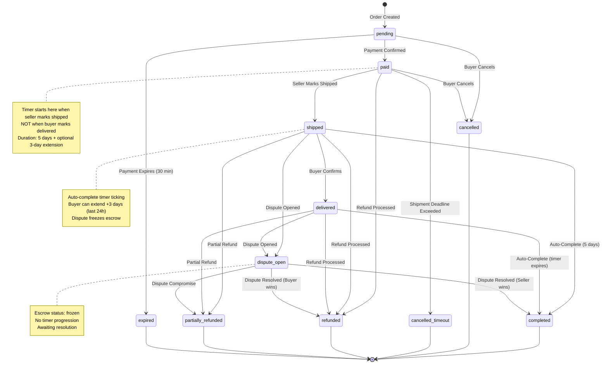
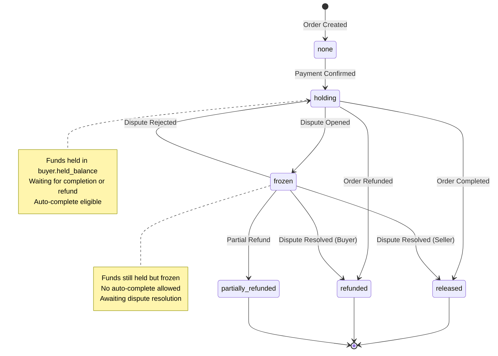

# 🔄 ORDER STATE MACHINE - VISUAL DOCUMENTATION

## Complete State Transition Diagram



## Escrow Status Parallel State Machine



## Critical Business Rules

### 1. Auto-Complete Timer Logic

```
┌─────────────────────────────────────────────────────────┐
│ Timer Lifecycle                                         │
├─────────────────────────────────────────────────────────┤
│                                                         │
│  T0: Order Created (pending)                           │
│      └─ No timer                                       │
│                                                         │
│  T1: Payment Confirmed (paid)                          │
│      └─ ReadyToShipBy calculated (prep time + grace)   │
│      └─ No auto-complete timer yet                     │
│                                                         │
│  T2: Seller Marks Shipped (shipped)  ← TIMER STARTS    │
│      └─ AutoReleaseAt = NOW() + 5 days                 │
│      └─ Buyer can confirm delivery manually            │
│                                                         │
│  T3: Buyer Confirms (delivered)                        │
│      └─ Timer continues (doesn't reset!)               │
│      └─ Extension still available                      │
│                                                         │
│  T4: Extension Requested (shipped only)                │
│      └─ Only in last 24 hours of timer                │
│      └─ AutoReleaseAt += 3 days                        │
│      └─ ConfirmationExtensionUsed = true               │
│                                                         │
│  T5: Timer Expires                                     │
│      └─ Auto-complete to completed                    │
│      └─ Escrow released to seller                     │
│                                                         │
└─────────────────────────────────────────────────────────┘
```

### 2. Dispute Impact

```
┌─────────────────────────────────────────────────────────┐
│ Dispute State Impact                                    │
├─────────────────────────────────────────────────────────┤
│                                                         │
│  BEFORE Dispute (status = shipped/delivered)           │
│  ├── Escrow Status: holding                            │
│  ├── Auto-complete: RUNNING                            │
│  └── Timer: Ticking towards AutoReleaseAt              │
│                                                         │
│  DURING Dispute (status = dispute_open)                │
│  ├── Escrow Status: frozen                             │
│  ├── Auto-complete: BLOCKED                            │
│  ├── HasDispute: true                                  │
│  └── Timer: STOPPED (no progression)                   │
│                                                         │
│  AFTER Dispute (resolution)                            │
│  ├── Buyer wins → refunded                             │
│  ├── Seller wins → completed                           │
│  └── Compromise → partially_refunded                   │
│                                                         │
└─────────────────────────────────────────────────────────┘
```

### 3. Payment Expiry Logic

```
┌─────────────────────────────────────────────────────────┐
│ Payment Expiry (Current Implementation)                │
├─────────────────────────────────────────────────────────┤
│                                                         │
│  ⚠️ INCONSISTENCY DETECTED:                            │
│                                                         │
│  Worker Query (OrderPaymentTimeoutWorker):             │
│    WHERE status = 'pending'                             │
│      AND created_at <= NOW() - INTERVAL '30 minutes'   │
│                                                         │
│  Order Check (Order.IsExpired()):                       │
│    return time.Now().After(order.PaymentExpiresAt)     │
│                                                         │
│  ISSUE: Two different expiry mechanisms!               │
│    - Worker uses created_at + 30 min (hardcoded)       │
│    - Order uses PaymentExpiresAt (dynamic)             │
│                                                         │
│  ✅ CORRECT APPROACH:                                  │
│    WHERE status = 'pending'                             │
│      AND payment_expires_at <= NOW()                   │
│                                                         │
└─────────────────────────────────────────────────────────┘
```

## Race Condition Analysis

### Auto-Complete vs Dispute Creation

```
┌─────────────────────────────────────────────────────────┐
│ Timeline: Race Condition                               │
├─────────────────────────────────────────────────────────┤
│                                                         │
│  T1: Worker Query Executes                             │
│      SELECT id FROM orders                             │
│      WHERE has_dispute = false                          │
│        AND auto_release_at <= NOW()                    │
│      Result: [order_123] ✓                             │
│                                                         │
│  T2: Dispute Created (RACE WINDOW)                     │
│      UPDATE orders SET has_dispute = true              │
│      WHERE id = order_123                              │
│      Result: order_123.has_dispute = true              │
│                                                         │
│  T3: Worker Attempts Completion                        │
│      BEGIN TRANSACTION                                 │
│      SELECT * FROM orders WHERE id = order_123         │
│      Result: has_dispute = true ✗                      │
│                                                         │
│  T4: Entity Layer Guard                                │
│      order.Complete()                                  │
│      if order.HasDispute {                             │
│          return DisputeActiveError ✗                  │
│      }                                                 │
│                                                         │
│  T5: Transaction Rollback                              │
│      ROLLBACK                                          │
│      Result: Order NOT completed ✓                     │
│                                                         │
├─────────────────────────────────────────────────────────┤
│                                                         │
│  MITIGATION: Defense in Depth                          │
│  1. Query Layer: has_dispute = false                   │
│  2. Entity Layer: order.Complete() checks HasDispute   │
│  3. Service Layer: Idempotency                         │
│                                                         │
│  ASSESSMENT: Mitigated but not eliminated              │
│  RECOMMENDATION: Add has_dispute check in transaction  │
│                                                         │
└─────────────────────────────────────────────────────────┘
```

## Money Flow Diagrams (gateway-funded model)

Under the canonical model, money physically lives at the payment gateway
clearing account. Buyer and seller wallet balances are NOT mutated by escrow
lifecycle events. Authoritative balances are tracked in the finance ledger
(`GATEWAY_CLEARING`, `SELLER_PAYABLE`, `PLATFORM_REVENUE`, `BUYER_REFUNDABLE`).

### Normal Completion Flow

```
┌──────────────────────────────────────────────────────────────────┐
│ Order Completion (gateway-funded)                                │
├──────────────────────────────────────────────────────────────────┤
│                                                                  │
│  1. Order Created — pricing snapshot only, no money movement     │
│                                                                  │
│  2. Payment Settled at Gateway                                   │
│       FinanceService.RecordGatewayPaymentSettlement:             │
│         GATEWAY_CLEARING += 30,000                               │
│       WalletService.CreateEscrowFromGatewaySettlement:           │
│         escrows row inserted, status='holding', amount=30,000    │
│       (No wallet.held_balance / available_balance mutation.)     │
│                                                                  │
│  3. Order Completed (release)                                    │
│       paymentService.ReleaseGatewayEscrowToSeller calls:         │
│         WalletService.ReleaseGatewayEscrow                       │
│           → escrow.status: holding → released                    │
│         FinanceService.RecordOrderRelease                        │
│           → GATEWAY_CLEARING -= 30,000                           │
│           → SELLER_PAYABLE  += 28,500                            │
│           → PLATFORM_REVENUE += 1,500                            │
│                                                                  │
└──────────────────────────────────────────────────────────────────┘
```

### Refund Flow

```
┌──────────────────────────────────────────────────────────────────┐
│ Order Refund (gateway-funded)                                    │
├──────────────────────────────────────────────────────────────────┤
│                                                                  │
│  1-2. Same as completion flow up to settlement.                  │
│                                                                  │
│  3. Refund decided (dispute resolution / timeout / manual)       │
│       WalletService.RefundGatewayEscrow                          │
│         → escrow.status: holding → refunded                      │
│       (No wallet balance mutation.)                              │
│                                                                  │
│  4. Gateway refund issued + webhook ack (refund pipeline)        │
│       RefundService.InitiateGatewayRefund → Midtrans             │
│       webhook → RefundService.HandleGatewayRefundAck →           │
│       FinanceService.RecordRefundReversal:                       │
│         → GATEWAY_CLEARING -= 30,000                             │
│         → BUYER_REFUNDABLE += 30,000                             │
│                                                                  │
└──────────────────────────────────────────────────────────────────┘
```

### Partial Refund Flow

```
┌──────────────────────────────────────────────────────────────────┐
│ Partial Refund (gateway-funded)                                  │
├──────────────────────────────────────────────────────────────────┤
│                                                                  │
│  3. Partial refund decided                                       │
│       WalletService.PartialRefundGatewayEscrow                   │
│         → escrow.status: holding → released (terminal)           │
│       FinanceService.RecordOrderRelease for the seller portion   │
│       + refund pipeline books the buyer-portion reversal on ack. │
│                                                                  │
└──────────────────────────────────────────────────────────────────┘
```

The legacy wallet-hold money flow (which mutated `buyer.held_balance` and
`buyer.available_balance` / `seller.available_balance` directly inside
`WalletService.ReleaseEscrow` / `RefundEscrow` / `PartialRefundEscrow`) has
been demolished. There is no fallback path.

## Safety Mechanisms Summary

```
┌─────────────────────────────────────────────────────────┐
│ DEFENSE IN DEPTH                                        │
├─────────────────────────────────────────────────────────┤
│                                                         │
│  LAYER 1: Database Query                               │
│  ├── has_dispute = false (auto-complete)               │
│  ├── escrow_status = 'holding' (auto-complete)         │
│  ├── FOR UPDATE SKIP LOCKED (workers)                  │
│  └── Unique constraints (idempotency)                  │
│                                                         │
│  LAYER 2: Entity Guards                                │
│  ├── canTransition() validation                        │
│  ├── order.Complete() checks HasDispute                │
│  ├── order.Complete() checks EscrowStatus              │
│  └── order.MarkShipped() validates shipping proof      │
│                                                         │
│  LAYER 3: Service Layer                                │
│  ├── Idempotency checks                                │
│  ├── Authorization checks                              │
│  ├── Account status checks (banned users)              │
│  └── Transaction rollback on error                     │
│                                                         │
│  LAYER 4: Wallet Service (Financial Authority)         │
│  ├── Idempotency keys for all operations               │
│  ├── Ledger validation                                 │
│  └── Atomic money movements                            │
│                                                         │
└─────────────────────────────────────────────────────────┘
```

## Critical Operations Flow

### MarkShipped Operation

```
1. IDEMPOTENCY CHECK
   └─ TryInsert(idempotencyKey, "order.shipped.{orderID}")
   
2. AUTHORIZATION
   └─ caller must be seller or system
   
3. ACCOUNT STATUS
   └─ seller must not be banned
   
4. ROW LOCK
   └─ GetForUpdate(orderID)
   
5. BUSINESS VALIDATION
   ├─ Status must be 'paid'
   ├─ ReadyToShipBy + grace_period must not be exceeded
   ├─ proof_type is required
   ├─ tracking_number required for tracking/phone
   ├─ shipping_proof_media required for manual
   └─ Format validation (tracking min 6 chars, phone min 10)
   
6. STATE TRANSITION
   ├─ Status: paid → shipped
   ├─ AutoReleaseAt = NOW() + 5 days (if not set)
   └─ Store shipping proof
   
7. PERSIST
   └─ UpdateStatusTx(order)
   
8. OUTBOX EVENT
   └─ InsertEvent("order.shipped", orderID)
```

### Complete Operation

```
1. ROW LOCK
   └─ GetForUpdate(orderID)
   
2. IDEMPOTENCY CHECK
   └─ if Status == completed AND EscrowStatus == released
       └─ return success (already completed)
   
3. AUTHORIZATION
   └─ caller must be buyer or system
   
4. ACCOUNT STATUS
   ├─ buyer must not be banned
   └─ seller must not be banned
   
5. SUPPORT DOMAIN GUARD
   └─ no active support tickets
   
6. PAYMENT STATUS GUARD
   └─ payment.status must be 'settlement' or 'capture'
   
7. STATE TRANSITION (Entity Layer)
   ├─ Status must be 'shipped' OR 'delivered'
   ├─ HasDispute must be false
   └─ EscrowStatus must be 'holding'
   
8. ESCROW + LEDGER OPERATION (gateway-funded)
   ├─ WalletService.ReleaseGatewayEscrow(orderID, gross)
   │   └─ escrow.status: holding → released (no wallet mutation)
   └─ FinanceService.RecordOrderRelease(orderID, sellerID, gross, ...)
       ├─ Idempotency key: "order_release_{orderID}"
       ├─ GATEWAY_CLEARING -= gross
       ├─ SELLER_PAYABLE   += sellerNet
       └─ PLATFORM_REVENUE += commission
       
9. REWARDS
   └─ CoinsService.EarnPointsForOrderCompletion()
       └─ 1 point per Rp1.000 of final paid amount

10. PERSIST
    └─ UpdateStatusTx(order)

11. OUTBOX EVENT
    └─ InsertEvent("order.completed", orderID)
```

## Key Findings Visualized

```
┌─────────────────────────────────────────────────────────┐
│ CRITICAL ISSUES                                         │
├─────────────────────────────────────────────────────────┤
│                                                         │
│  🔴 CRITICAL #1: Payment Expiry Inconsistency          │
│  ├── Worker: created_at + 30 min (hardcoded)          │
│  └── Order: PaymentExpiresAt (dynamic)                │
│                                                         │
│  🟡 WARNING #1: Idempotency Table Growth               │
│  └── No cleanup mechanism for old records              │
│                                                         │
│  🟡 WARNING #2: Auto-Complete Race Condition           │
│  └── Mitigated but not fully eliminated                │
│                                                         │
│  🟢 STRENGTH: No Money Leaks Detected                  │
│  └── Escrow refund is blocking (transaction rollback)   │
│                                                         │
│  🟢 STRENGTH: Defense in Depth                          │
│  └── 4 layers of protection (query → entity → svc → wallet) │
│                                                         │
└─────────────────────────────────────────────────────────┘
```


